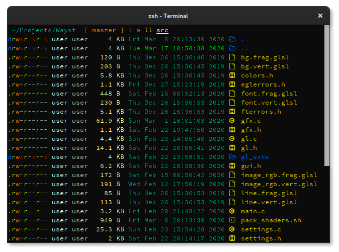

<p align="center">
  
</p>

# About
Simple terminal emulator for Wayland and X11 with OpenGL rendering and minimal dependencies.

**This is roughly alpha quality, expect bugs!**

# Features
* Unicode support
* Text reflow
* 24-bit colors
* Dynamic colors
* All text properties (squiggly underline, blinking, overline etc.)
* Resizable font
* Subpixel antialiasing
* Mouse reporting
* Scrollback
* Mouse text selection
* Clipboard
* Configurable keybindings
* Clickable links, OSC 8 links
* Command history and marks[*](https://github.com/91861/wayst#shell-integration)
* kitty image protocol (experimental)

# To-Do
* Ligatures
* Sixel graphics
* All xterm and vte control sequences

# Building
```shell
make
make install
```

#### Dependencies:
* OpenGL >= 2.1
* freetype >= 2.10
* fontconfig
* xkbcommon [wayland]
* utf8proc [optional]
* notify-send [optional]

To build without X11 or Wayland support set ```window_protocol=wayland``` or ```window_protocol=x11``` respectively. With both backends enabled wayst will default to wayland. You can force X11 mode with the ```xorg-only``` option.

To build with debuging symbols set ```mode=debugoptimized```.


## Installation from AUR

You can install [wayst-git](https://aur.archlinux.org/pkgbase/wayst-git/) from AUR (arch user repository)

```shell
yay -S wayst-git
```


# Usage

#### Configuration file
All option can be set in a configuration file or passed as command line arguments. To see all supported options run ```wayst --help```.\
\
Wayst will look for: ```$XDG_CONFIG_HOME/wayst/config``` or ```$HOME/.config/wayst/config```.

Example:
```ini
# '#' starts a line comment
# Strings with spaces need double quotes (use \" for " and \\ for \).

# Set a list of primary fonts (All available styles will be loaded)
# You need to list EVERY font you want to use. for example:
# "IBM Plex Sans Thai" for thai script, "Noto Sans Math" for math symbols.
font = [
    # You can set codepoint ranges to which a given font should be applied.
    # Here we define <min>..u+24ff and u+2580..<max> to exclude the unicode
    # box drawing block. Those characters will be loaded (if present) from
    # the following fonts in this list.
    "mononoki:..u+24ff:u+2580..",
    "sauce code pro nerd font",
    # Mixing ttf/otf with bitmap fonts is ok
    # You can set an offset to keep fonts smaller/larger than the global size.
    "Terminus:-3"
]

# Or just use a single font
# font = "IBM Plex Mono"

# Set a list of 'symbol' fonts (Only the 'Regular' style will be loaded)
font-symbol = [
    "Noto Sans Symbols",
    "FontAwesome"
]

# Set a list of color bitmap fonts.
font-color = "Noto Color Emoji"

# use Semibold as the Bold style
style-bold = "Semibold"
font-size = 10
dpi = 96

# Load one of the default colorschemes
colorscheme = "wayst"
# Overwrite parts of the colorscheme
fg-color = "#c7eeff"
bg-color = "#000000ee"
unfocused-tint = "#00000033"

visual-bell = none

term = "xterm-256color"

title = "Terminal"

# You can format the window title using variables: sAppTitle, sVtTitle, bCommandIsRunning,
# i32CommandTimeSec, sRunningCommand, i32Rows, i32Cols, i32Width, i32Height.
# To interpolate a variable use '{variableName}'. Variables can be used to define simple conditionals
# eg: '{?i32Width > 80:the window is wider than 80px}'
# The default format string displays the reported command if its running longer than a second
# title-format = "{sVtTitle}{?bCommandIsRunning && i32CommandTimeSec > 1: ({sRunningCommand})} - {sAppTitle}"
# Other examples:
# title-format = "{sAppTitle} - [{sVtTitle}]"                                         # Terminal - [zsh:~]
# title-format = "{sVtTitle} [{i32Cols}x{i32Rows}]"                                   # zsh:~ [80x24]
# title-format = "{sVtTitle}{?i32Cols != 80 || i32Rows != 24: [{i32Cols}x{i32Rows}]}" # zsh:~ [132x54]

title-format = "{sVtTitle}" # <set by program>

scrollback = 1000

# key names are the same as xorg keysym names (case sensitive!)
bind-key-debug=Ctrl+Shift+Return
bind-key-enlarge=Ctrl+Shift+equal
bind-key-shrink=Ctrl+Shift+minus
bind-key-copy=Ctrl+Shift+y
bind-key-paste=Ctrl+Shift+p
```

#### Shell integration
Wayst can use [iTerm2 shell integration sequences](https://iterm2.com/documentation-shell-integration.html) or
[VTE prompt notifications](https://bugzilla.gnome.org/show_bug.cgi?id=711059) to track command history.

#### Default Keybindings
Keys|Action|
 --- | ---
```Ctrl```+```Shift```+```c```            | Copy to clipboard
```Ctrl```+```Shift```+```x```            | Copy output of last command to clipboard[*](https://github.com/91861/wayst#shell-integration)
```Ctrl```+```Shift```+```v```            | Paste from clipboard
```Ctrl```+```Shift```+```=```            | Increase font size
```Ctrl```+```Shift```+```-```            | Decrease font size
```Ctrl```+```Shift```+```Up/Down```      | Scroll
```Ctrl```+```Shift```+```Page Up/Down``` | Scroll by page
```Ctrl```+```Shift```+```Left/Right```   | Jump to previous/next command output or mark[*](https://github.com/91861/wayst#shell-integration)
```Ctrl```+```Shift```+```u```            | Enter unicode character by hex code
```Ctrl```+```Shift```+```k```            | Enter vi-like keyboard select mode
```Ctrl```+```Shift```+```d```            | Start new instance in active work directory (set by OSC 7)
```Ctrl```+```Shift```+```F12```          | HTML screen dump
```Ctrl```+```Shift```+```\```            | Pipe to external program
```LMB```                                 | Select text
```RMB```                                 | Change selected region
```Shift```+```LMB```                     | Select text in mouse reporting mode
```Ctrl``` + ```LMB```                    | Open link/Box select

# License
MIT
